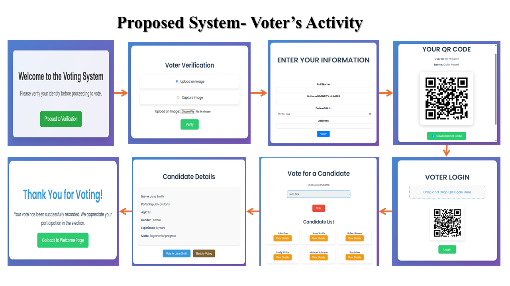

# Leveraging Blockchain and Machine Learning for a Secure and Transparent Voting System

This project presents an end-to-end electronic voting system that combines blockchain technology with facial recognition to deliver a secure, transparent, and verifiable voting experience. By utilizing smart contracts for immutable vote storage and machine learning for real-time biometric verification, the system ensures that only eligible voters can participate—and that every vote is tamper-proof and traceable without compromising personal privacy.

---

## 🖼️ System Interface

### Voter Interaction Panel

### Election Committee Dashboard

These interfaces demonstrate how voters and election officials interact with the system—covering registration, authentication, candidate viewing, vote casting, and result monitoring.

---

## 🛠️ Technologies Implemented

| Component      | Stack                        |
|----------------|------------------------------|
| Web Interface  | Flask, HTML, CSS (Jinja2)    |
| Backend Logic  | Python (Flask Framework)     |
| Blockchain     | Solidity, Ganache, Web3.py   |
| Face Matching  | OpenCV, TensorFlow/Keras     |
| Data Handling  | JSON / CSV (local files)     |

To facilitate communication between the smart contract and Python-based backend, the system leverages `web3.py`. This enables vote transactions and real-time interactions between the frontend and the blockchain layer.

---

## ✅ Key Features

- QR code-based login tied to voter identity  
- Facial recognition using machine learning for voter verification  
- Blockchain-powered vote storage for tamper-proof records  
- Real-time monitoring of voting progress and election closure  
- Admin panel for candidate management and result publishing  
- Voter access control via NID and DOB matching  
- Prevention of duplicate voting and unauthorized access  

---

## 🧪 Testing Guidelines

To replicate or test the system in a local environment, follow these steps:

1. Use `synthetic_dataset_making.py` to auto-generate voter data including images and credentials  
2. Start the Ganache blockchain simulator  
3. Update the contract address and ABI 
4. Contract will be Deployed once the election committee run the app 
5. Run the Flask app with `python app.py`  
6. Access the voter and admin dashboards in the browser  
7. Simulate voter login using QR code and face input  
8. Cast votes, close the election, and review the results  

---

## 🔐 Privacy Considerations

- Biometric data is never stored on-chain; only temporary face embeddings are processed for matching  
- The blockchain stores anonymized vote hashes, not personally identifiable information  
- Real-time facial authentication occurs locally and is never transmitted externally  
- The design avoids permanent storage of sensitive data, aligning with best practices in digital privacy laws such as GDPR  

---

## 🌱 Future Improvements

- Introduce **Decentralized Identifiers (DIDs)** for enhanced voter anonymity and portability  
- Explore **Zero-Knowledge Proofs (ZKPs)** for vote eligibility verification without disclosing private data  
- Deploy the system on public Ethereum testnets such as **Goerli** or **Sepolia** for real-world simulation  
- Implement ML-based anomaly detection to flag suspicious voting patterns  
- Extend mobile support with offline QR voter credentials  

---

## 📄 License

This repository is distributed under the **MIT License**.  
You are welcome to use, adapt, or expand this project with proper attribution to the original creator.

---

## 🧾 Research Statement

This system was developed as part of an academic research initiative titled:

**"Leveraging Blockchain and Machine Learning for a Secure and Transparent Voting System"**

The project investigates how decentralized technologies and machine learning can be combined to create secure, accessible, and trustworthy electronic voting platforms. It serves as a practical demonstration of how smart contracts and real-time biometric authentication can mitigate key risks in digital election environments.

---
